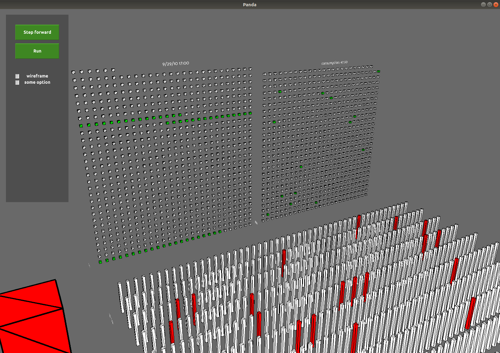
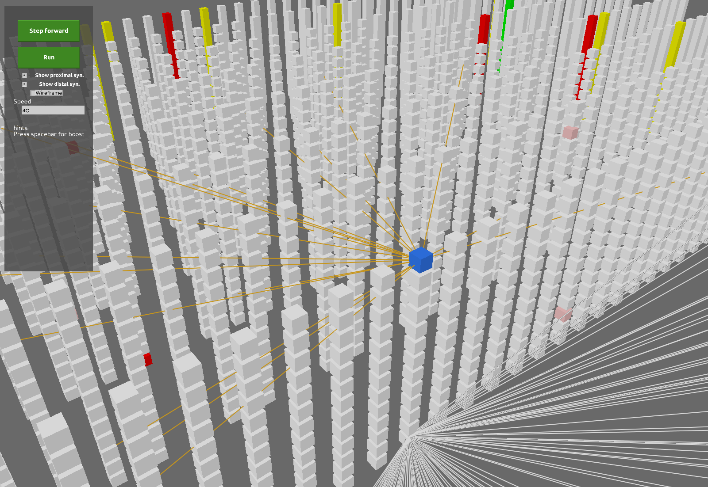
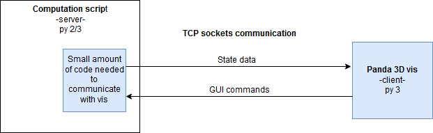

# HTMpandaVis

(I will add soon some instruction how to install and use with examples)

Screenshots for visualization of the "hotgym" example

This project aspires to create tool that helps **visualize HTM systems in 3D** by using opensource framework for 3D rendering https://www.panda3d.org/

It should allow to see architecture of the system in 3D, e.g. connection of several layers and inputs and to see input representation,
activity of columns and even individual cells in each simulation step.
User can observe vast scalable space by moving as "ghost" and interact with objects.
It is supposed as tool for educational purpose or as an inspect tool.

I was inspired by following:
- [HTM school Episode 10 visualization - Topology](https://www.youtube.com/watch?v=HTW2Q_UrkAw&t=688s)
- [Highbrow](https://github.com/htm-community/highbrow)
- [Sanity](https://github.com/htm-community/sanity-nupic) 

The visualization is application written in Python3 and strictly separated from "computation script" by TCP sockets.

Currently the "computation script" is hotgym example using [htm.core](https://github.com/htm-community/htm.core) extended by
small amout of code to communicate with visualization.
That is also main idea, anybody can take his own current computation script, slightly modify it and use this vis tool.

